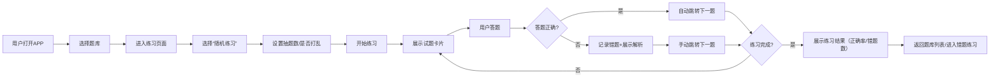

# Effective Brushing 产品需求文档（PRD）
## 文档信息
| 项         | 内容                              |
|------------|---------------------------------|
| 文档版本   | V1.0                            |
| 编写日期   | 2025-12-26                      |
| 产品名称   | Effective Brushing（高效刷题APP）     |
| 核心目标   | 打造轻量化、高效的移动端刷题工具，适配备考场景的碎片化刷题需求 |

## 1. 产品概述
### 1.1 产品定位
一款面向学生/职场备考人群的移动端刷题APP，主打「多模式练习、离线刷题、数据化复盘」，解决传统刷题工具“功能繁琐、依赖网络、复盘低效”的痛点，聚焦“高效刷题”核心场景。

### 1.2 核心目标
- 用户侧：降低刷题操作成本，提升碎片化时间刷题效率，精准定位薄弱知识点；
- 产品侧：轻量化设计，无冗余功能，核心流程（刷题-错题-复盘）闭环。

### 1.3 目标用户画像
| 用户类型       | 核心特征                                                                 | 核心需求                     |
|----------------|--------------------------------------------------------------------------|------------------------------|
| 学生备考族     | 在校学生，备考四六级/考研/考证，碎片化时间多（课间/通勤）| 随机刷题、错题归纳、模拟考试 |
| 职场考证族     | 职场人士，备考职业证书，时间零散，需离线刷题（如地铁/无网环境）| 离线练习、题型专项训练       |

## 2. 核心功能需求（按优先级）
### 2.1 P0级（核心必做，上线必备）
#### 2.1.1 题库管理
| 功能点         | 详细需求                                                                 | 交互说明                                                                 |
|----------------|--------------------------------------------------------------------------|--------------------------------------------------------------------------|
| 题库上传       | 支持手动输入/批量导入题库（暂支持文本导入，后续迭代图片/OCR）| 上传后自动生成题库列表，标注题库名称/题数/创建时间                       |
| 题库列表展示   | 展示所有已上传题库，支持按名称搜索/按创建时间排序                         | 点击题库进入练习页面，长按题库可删除/重命名                             |
| 试题详情展示   | 展示题干、选项（单选/多选）、正确答案、解析                               | 练习页以卡片形式展示，上下滑动切换试题                                   |

#### 2.1.2 多模式练习
| 练习模式       | 详细需求                                                                 | 交互说明                                                                 |
|----------------|--------------------------------------------------------------------------|--------------------------------------------------------------------------|
| 顺序练习       | 按题库原有顺序逐题刷题，支持上一题/下一题切换                             | 答对后可手动跳转，答错弹窗提示“查看解析”                                 |
| 随机练习       | 自定义抽取题数（如20/50题），支持“打乱顺序”，避免重复选题                 | 点击“开始随机练习”后，自动加载随机试题，完成后展示正确率                 |
| 答题交互       | 单选/多选答题，提交答案后即时反馈（正确/错误），答对自动跳转下一题         | 错误答题后停留在当前题，需手动点击“下一题”，并记录到错题集               |

#### 2.1.3 离线刷题
| 功能点         | 详细需求                                                                 | 交互说明                                                                 |
|----------------|--------------------------------------------------------------------------|--------------------------------------------------------------------------|
| 题库下载       | 支持将题库下载到本地，标注“已离线”标签                                   | 下载前提示“预计占用空间XX”，下载完成后弹窗提示                           |
| 离线练习       | 无网络环境下，可正常练习已下载的题库，答题记录暂存本地                   | 联网后自动同步离线答题记录到云端                                         |

#### 2.1.4 错题管理
| 功能点         | 详细需求                                                                 | 交互说明                                                                 |
|----------------|--------------------------------------------------------------------------|--------------------------------------------------------------------------|
| 错题自动记录   | 答题错误的试题自动加入错题集，关联所属题库                               | 错题集按题库分类展示，标注错误次数                                       |
| 错题练习       | 单独练习错题集内的试题，完成后可手动标记“已掌握”（移出错题集）| 错题练习逻辑与随机练习一致，答对后默认标记“已掌握”                       |

### 2.2 P1级（重要，核心功能完成后迭代）
| 功能模块       | 核心需求                                                                 |
|----------------|--------------------------------------------------------------------------|
| 题型专项练习   | 按题型（单选/多选/判断）筛选试题，仅练习指定题型                         |
| 收藏试题       | 支持收藏重点试题，单独生成收藏集，可练习收藏试题                         |
| 模拟考试       | 自定义考试时长/题数，自动计时，交卷后展示总分/错题/正确率                 |
| 数据复盘       | 展示刷题总数/正确率/错题数，按时间维度（日/周）统计答题数据               |

### 2.3 P2级（次要，后续迭代）
| 功能模块       | 核心需求                                                                 |
|----------------|--------------------------------------------------------------------------|
| AI解析         | 调用AI接口生成试题解析/考点分析                                           |
| 拍照录题       | 拍照识别试题（OCR），自动生成题干/选项                                   |
| 试题去重       | 上传题库时自动检测重复试题（按题干MD5），提示用户去重                     |

## 3. 非功能需求
### 3.1 性能需求
- 响应速度：题库列表加载≤1s，随机抽题≤0.5s，离线练习无卡顿；
- 存储需求：离线题库本地存储占用空间≤100MB（单题库）；
- 兼容性：支持Android 8.0+/iOS 12.0+。

### 3.2 体验需求
- 轻量化：APP安装包≤20MB，无开屏广告、无冗余弹窗；
- 操作简洁：核心流程（刷题）操作步骤≤3步（打开APP→选择题库→开始练习）。

### 3.3 数据安全需求
- 本地数据加密：离线题库/答题记录本地加密存储，防止数据泄露；
- 同步安全：联网同步数据时采用HTTPS，敏感数据（如答题记录）不明文传输。

## 4. 核心交互流程（随机练习）

## 5. 原型说明（暂代）
### 5.1 核心页面布局
* 首页：顶部搜索栏 + 题库列表（卡片式） + 底部导航（首页 / 错题 / 我的）；
* 练习页：试题卡片（占屏幕 80%） + 底部答题区 + 上一题 / 下一题按钮；
* 结果页：正确率环形图 + 错题数 / 总题数 + “错题练习” 按钮。

## 6. 版本规划
* V1.0（首发）：上线 P0 级所有功能（题库管理 + 多模式练习 + 离线刷题 + 错题管理）；
* V1.1：迭代 P1 级功能（题型练习 + 收藏 + 模拟考试）；
* V1.2：迭代 P2 级功能（AI 解析 + 拍照录题）。