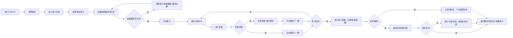

# Effective Brushing 产品需求文档（PRD）
## 文档信息
| 项    | 内容                                                  |
|------|-----------------------------------------------------|
| 文档版本 | V1.1（适配技术落地）                                        |
| 编写日期 | 2025-12-26                                          |
| 产品名称 | Effective Brushing（高效刷题APP）                         |
| 核心目标 | 打造轻量化、高效、高可用的移动端刷题工具，适配备考场景的碎片化刷题需求，兼顾离线稳定性与数据同步可靠性 |

## 1. 产品概述
### 1.1 产品定位
一款面向学生 / 职场备考人群的移动端刷题 APP，主打「多模式练习、离线刷题、数据化复盘」，解决传统刷题工具 “功能繁琐、依赖网络、复盘低效、数据同步不可靠” 的痛点，聚焦 “高效刷题” 核心场景，同时保障服务稳定性和数据安全性。
### 1.2 核心目标
- 用户侧：降低刷题操作成本，提升碎片化时间刷题效率，精准定位薄弱知识点，保障离线 / 在线场景下的数据一致性；
- 产品侧：轻量化设计，无冗余功能，核心流程（刷题 - 错题 - 复盘）闭环；
- 技术侧：适配生产级后端架构，保障服务高可用、数据安全、同步可靠.

### 1.3 目标用户画像
| 用户类型  | 核心特征                             | 核心需求                  |
|-------|----------------------------------|-----------------------|
| 学生备考族 | 在校学生，备考四六级/考研/考证，碎片化时间多（课间/通勤）   | 随机刷题、错题归纳、模拟考试        |
| 职场考证族 | 职场人士，备考职业证书，时间零散，需离线刷题（如地铁/无网环境） | 离线数据同步可靠、题库存储安全、服务不宕机 |

## 2. 核心功能需求（按优先级）
### 2.1 P0级（核心必做，上线必备）
#### 2.1.1 题库管理
| 功能点    | 详细需求                                                                | 交互说明                                                       | 技术适配说明                                 |
|--------|---------------------------------------------------------------------|------------------------------------------------------------|----------------------------------------|
| 题库上传   | 支持手动输入/批量导入题库（暂支持文本导入，后续迭代图片/OCR）; 批量导入支持 txt/excel 格式，单文件≤20MB | 上传后自动生成题库列表，标注题库名称/题数/创建时间 ;  上传失败弹窗提示 “文件格式错误 / 大小超限” | 题库文件存储至 MinIO 对象存储，后端做文件格式校验、大小限制、异常处理 |
| 题库列表展示 | 展示所有已上传题库，支持按名称搜索/按创建时间排序序； 标注 “已离线”/“未离线” 状态                   | 点击题库进入练习页面，长按题库可删除/重命名; 删除前二次确认，防止误操作                  | 题库元数据存储至 Oracle 数据库，支持分页加载（避免列表卡顿）     |
| 试题详情展示 | 展示题干、选项（单选/多选）、正确答案、解析 ; 支持解析文本换行 / 格式保留                        | 练习页以卡片形式展示，上下滑动切换试题     ; 滑动卡顿率≤0.1%                   | 试题数据按需加载，避免一次性加载大量数据导致 APP 卡顿          |

#### 2.1.2 多模式练习
| 练习模式 | 详细需求                                                          | 交互说明                                                 | 异常处理                        |
|------|---------------------------------------------------------------|------------------------------------------------------|-----------------------------|
| 顺序练习 | 按题库原有顺序逐题刷题，支持上一题/下一题切换  ; 记忆上次练习位置，再次进入可续刷               | 答对后可手动跳转，答错弹窗提示“查看解析” ; 无操作 30s 自动锁屏（可选）         | 网络波动时不影响本地练习，答题记录暂存本地       |
| 随机练习 | 自定义抽取题数（如20/50题），支持“打乱顺序”，避免重复选题 ; 抽题范围可选择 “全部 / 未答 / 错题” | 点击“开始随机练习”后，自动加载随机试题，完成后展示正确率  ; 抽题耗时≤0.5s       | 抽题时异常（如题库为空）弹窗提示 “该题库无可用试题” |
| 答题交互 | 单选/多选答题，提交答案后即时反馈（正确/错误），答对自动跳转下一题 ; 支持 “标记试题”（疑难点）       | 错误答题后停留在当前题，需手动点击“下一题”，并记录到错题集     ; 答题反馈延迟≤0.2s | 答题记录本地 + 云端双存储，防止单端数据丢失     |

#### 2.1.3 离线刷题
| 功能点    | 详细需求                                                   | 交互说明                                          | 数据同步规则                                                                    |
|--------|--------------------------------------------------------|-----------------------------------------------|---------------------------------------------------------------------------|
| 题库下载   | 支持将题库下载到本地，标注“已离线”标签          : 支持批量下载 / 断点续传（大题库） | 下载前提示“预计占用空间XX”，下载完成后弹窗提示 ; 下载失败自动重试 2 次  | 下载进度实时同步，失败后记录失败原因（如网络 / 空间不足）                                            |
| 离线练习   | 无网络环境下，可正常练习已下载的题库，答题记录暂存本地 ; 本地存储加密               | 联网后自动同步离线答题记录到云端   ; 同步时展示 “同步中” loading	 | 1. 同步优先级：本地新数据覆盖云端旧数据； 2. 同步失败：保留本地数据，下次联网自动重试； 3. 冲突处理：以用户最新操作为准 |
| 同步状态展示 | 	首页 / 题库页标注 “待同步 XX 条记录”，同步完成后自动清除                     | 点击 “待同步” 可手动触发同步，同步成功弹窗提示	                    | 后端做同步事务处理，避免数据同步不全                                                        |                          
#### 2.1.4 错题管理
| 功能点    | 详细需求                                                      | 交互说明                                        | 数据准确性保障                    |
|--------|-----------------------------------------------------------|---------------------------------------------|----------------------------|
| 错题自动记录 | 答题错误的试题自动加入错题集，关联所属题库 ;    记录错误时间 / 错误次数 / 错误原因（可选填写） | 错题集按题库分类展示，标注错误次数   ; 支持按错误次数排序         | 错题记录本地 + 云端双存储，删除错题需两端同步删除 |
| 错题练习   | 单独练习错题集内的试题，完成后可手动标记“已掌握”（移出错题集）;支持 “只练多次错误试题”            | 错题练习逻辑与随机练习一致，答对后默认标记“已掌握” ; 标记后即时更新错题数 | 标记 “已掌握” 需二次确认，防止误操作       |
### 2.2 P1 级（重要，核心功能完成后迭代）
|功能模块|  核心需求 |技术适配说明|
|---|---|---|
|题型专项练习|按题型（单选 / 多选 / 判断）筛选试题，仅练习指定题型； 支持题型组合筛选（如单选 + 判断）|后端做题型索引优化，筛选耗时≤0.3s|
|收藏试题|支持收藏重点试题，单独生成收藏集，可练习收藏试题；收藏集支持导出 / 分享|收藏数据同步规则同错题集，保障跨设备同步|
|模拟考试|自定义考试时长 / 题数，自动计时，交卷后展示总分 / 错题 / 正确率； 支持中途暂停（保留进度|考试数据实时保存，防止闪退丢失进度|
|数据复盘|展示刷题总数 / 正确率 / 错题数，按时间维度（日 / 周）统计答题数据； 生成薄弱知识点分析（按题型 / 错题原因）|统计数据按需计算，避免 APP 启动时卡顿|

### 2.3 P2 级（次要，后续迭代）
|功能模块|  核心需求 |技术依赖|
|---|---|---|
| AI 解析  | 调用 AI 接口生成试题解析 / 考点分析； 支持手动触发 AI 解析，解析结果可收藏  | 依赖讯飞星火 API，后端做接口限流 / 异常降级（API 不可用时提示 “暂不支持”）  |
|  拍照录题 | 拍照识别试题（OCR），自动生成题干 / 选项； 支持手动修正识别结果  |  依赖百度 OCR API，识别结果本地缓存，减少 API 调用 |
|  试题去重 |   上传题库时自动检测重复试题（按题干 MD5），提示用户去重； 支持批量去重|   后端做 MD5 哈希计算，去重检测耗时≤1s（单题库）|
## 3. 非功能需求（重点补充，匹配后端实现）
### 3.1 性能需求（细化指标）
- 响应速度：
    - 题库列表加载≤1s（冷启动）/≤0.5s（热启动）；
    - 随机抽题≤0.5s；
    - 答题反馈≤0.2s；
    - 离线练习无卡顿（帧率≥60fps）；
- 存储需求：
  - 离线题库本地存储占用空间≤100MB（单题库）；
  - 本地数据加密存储，加密算法符合行业标准；
- 兼容性：
  - 支持 Android 8.0+/iOS 12.0+；
  - 适配主流分辨率（手机 / 平板）；
- 同步性能：
  - 离线记录同步≤3s（≤100 条）；
  - 同步失败自动重试 2 次，重试间隔 5s。
### 3.2 可用性需求（新增，保障服务稳定）
容错能力：
- 服务可用性：后端服务可用性≥99.9%（核心功能）；
  - 网络波动时，本地练习不受影响；
  - 后端服务异常时，APP 提示 “服务暂不可用，可继续离线练习”；
  - 数据库 / MinIO 异常时，后端做降级处理（仅影响上传 / 同步，不影响本地练习）；
  - 监控告警：核心功能异常（如同步失败率＞1%）触发告警，及时修复。

### 3.3 体验需求（细化）
- 轻量化：
  - APP 安装包≤20MB；
  - 无开屏广告、无冗余弹窗、无强制授权；
- 操作简洁：
  - 核心流程（刷题）操作步骤≤3 步（打开 APP→选择题库→开始练习）；
  - 关键操作（如删除题库 / 错题）二次确认，防止误操作；
- 容错设计：
  - 输入错误（如抽题数＞题库总数）弹窗提示 “抽题数不能超过题库总数”；
  - 无网络时，非核心功能（如同步）禁用并提示，核心功能（离线练习）正常可用。

###  3.4 数据安全需求（补充技术细节）
- 本地数据安全：
  - 离线题库 / 答题记录 AES 加密存储，防止 ROOT / 越狱后数据泄露；
  - 敏感数据（如用户答题记录）不存储在 SD 卡；
- 传输安全：
  - 联网同步数据采用 HTTPS 协议，敏感数据（如答题记录）不明文传输；
  - 接口调用采用 JWT 认证，防止未授权访问；
- 云端安全：
  - 云端数据（题库 / 答题记录）按用户隔离，防止越权访问；
  - 后端做接口限流，防止恶意请求（如批量刷接口）；
- 备份需求：
  - 云端数据每日自动备份，保留 7 天历史版本，支持数据恢复。

### 3.5 可维护性需求（新增，适配后端架构）
- 日志需求：
  - APP 端记录关键操作日志（如下载 / 同步 / 答题），便于排查用户问题；
  - 后端记录异常日志，对接 Sentry 监控，及时发现并修复问题；
- 版本兼容：
  - 前后端版本兼容，低版本 APP 可适配高版本后端接口（向下兼容）；
  - 数据同步协议可扩展，支持后续功能迭代。

## 4. 核心交互流程（随机练习，补充异常分支）

## 5. 原型说明（补充细节）
### 5.1 核心页面布局
- 首页：
  - 顶部搜索栏 + 待同步提示（右上角）；
  - 题库列表（卡片式，标注 “已离线”/“待同步 XX 条”）；
  - 底部导航（首页 / 错题 / 我的）；
- 练习页：
  - 试题卡片（占屏幕 80%，支持解析展开 / 收起）；
  - 底部答题区（单选 / 多选按钮）；
  - 上一题 / 下一题按钮（左右） + 标记按钮（右上角）；
- 结果页：
  - 正确率环形图 + 错题数 / 总题数；
  - “错题练习” 按钮 + “重新练习” 按钮；
  - 薄弱知识点提示（如 “单选题正确率仅 60%”）。
## 6. 版本规划（补充技术迭代）
| 版本	   | 上线功能                                     | 	技术保障（新增）                                                            |
|-------|------------------------------------------|----------------------------------------------------------------------|
| V1.0	 | 上线 P0 级所有功能（题库管理 + 多模式练习 + 离线刷题 + 错题管理）	 | 1. 后端生产级架构（异常处理 / 事务 / 日志 / Sentry）； 2. 数据同步可靠性保障； 3. 本地数据加密 |
| V1.1	 | 迭代 P1 级功能（题型练习 + 收藏 + 模拟考试）	             | 1. 题型索引优化； 2. 跨设备同步功能； 3. 考试数据实时保存                           |
| V1.2	 | 迭代 P2 级功能（AI 解析 + 拍照录题）	                 | 1. AI 接口限流 / 降级； 2. OCR 识别结果缓存； 3. 试题去重算法优化                  |
## 7. 验收标准（新增，便于测试）
### 7.1 功能验收
- 核心功能覆盖率 100%（P0 级）；
- 离线练习场景：断网后可正常刷题，联网后同步成功率≥99%；
- 异常场景：
  - 题库上传失败（格式 / 大小错误）提示准确；
  - 同步失败后本地数据不丢失，重试后可同步；
  - 后端服务异常时，本地练习不受影响。
### 7.2 性能验收
- 所有性能指标达标（如题库加载≤1s、抽题≤0.5s）；
- 长时间使用（连续刷题 1 小时）无卡顿 / 闪退；
- 离线存储加密验证通过（ROOT / 越狱后无法读取明文）。
### 7.3 安全验收
- 接口调用需 JWT 认证，未授权访问返回 401；
- 敏感数据传输加密，抓包无法获取明文；
- 云端数据按用户隔离，无法访问其他用户数据。