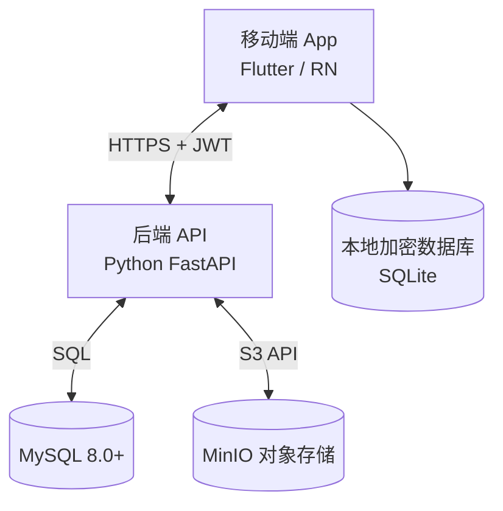
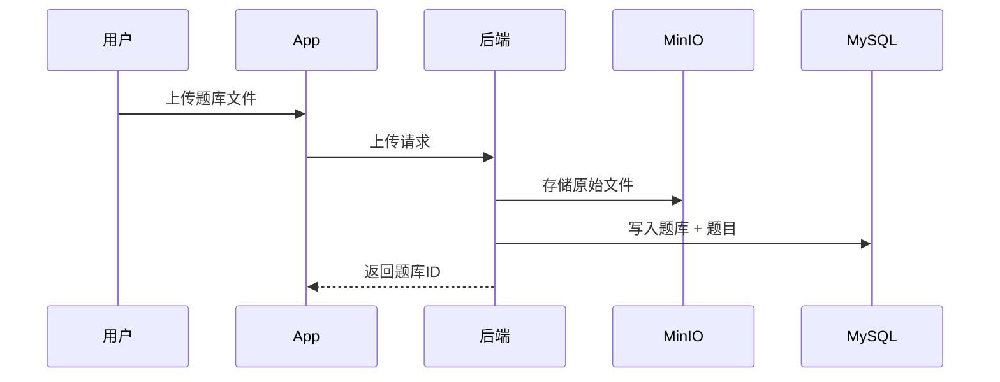
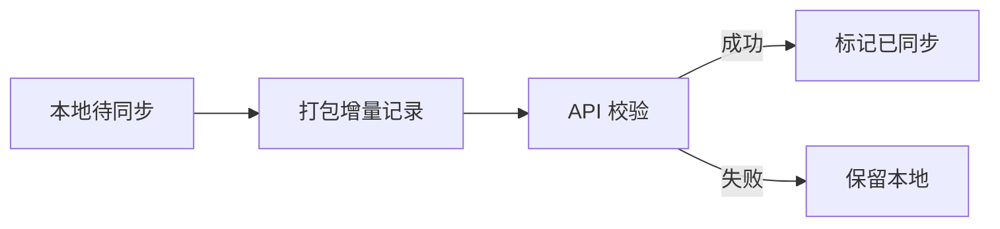
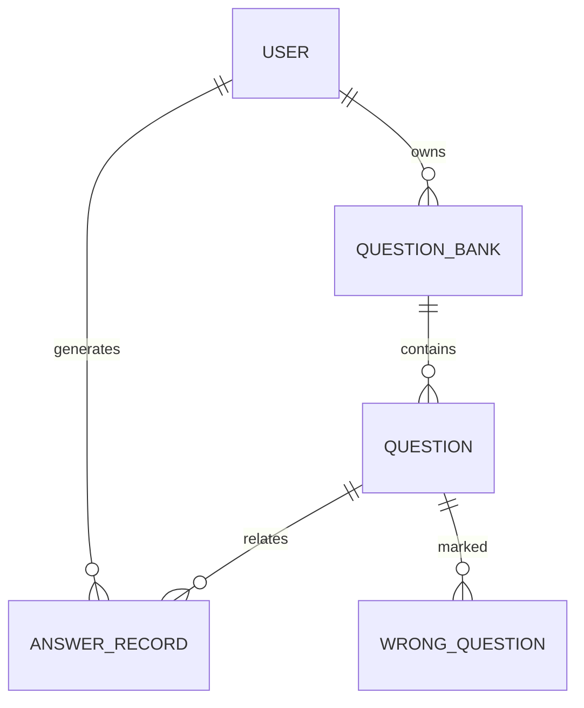
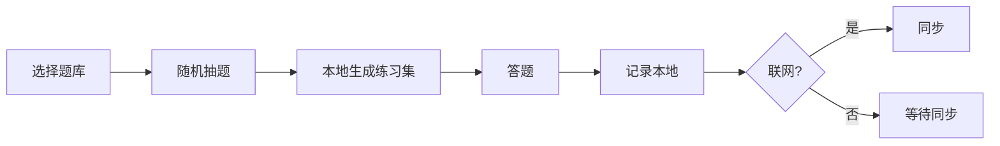

# Effective Brushing 技术设计文档（TDD）

> 基于《Effective Brushing PRD V1.1》设计

---

## 1. 技术目标与设计原则

### 1.1 技术目标

* 支撑 **高频刷题 + 离线优先** 的核心场景
* 保证 **数据一致性 / 同步可靠性 / 可扩展性**
* 架构清晰，便于个人长期维护与能力成长（MySQL / 后端能力）

### 1.2 设计原则

* **Offline First**：本地可完整刷题，网络仅用于同步
* **核心路径最简**：刷题 → 记录 → 同步 → 复盘
* **数据可追溯**：所有答题行为可回放、可统计
* **渐进式复杂度**：P0 简洁，P1/P2 可平滑扩展

---

## 2. 总体技术架构

### 2.1 架构总览（逻辑）



### 2.2 架构说明

* **前端**：

  * 本地 SQLite（AES 加密）
  * 本地状态即事实源（Source of Truth）
* **后端**：

  * 纯 API 服务，不参与刷题流程
  * 负责校验 / 同步 / 聚合统计
* **存储分工**：

  * MySQL：结构化核心数据
  * MinIO：题库原始文件 / 资源文件

---

## 3. 核心模块设计

### 3.1 题库模块

#### 3.1.1 逻辑拆分

* 题库元数据（DB）
* 题目明细（DB）
* 原始上传文件（MinIO）

#### 3.1.2 流程



---

### 3.2 刷题与答题记录

#### 3.2.1 本地优先策略

* 答题行为 **100% 写本地**
* 网络仅用于：

  * 上传增量记录
  * 拉取远端更新

#### 3.2.2 答题记录状态机

* NEW（本地产生）
* SYNCED（已同步）

---

### 3.3 同步机制设计

#### 3.3.1 同步触发条件

* App 启动
* 网络恢复
* 用户手动触发

#### 3.3.2 同步原则

* **本地优先**（Last Write Wins）
* 单条记录幂等（record_id + version）



---

## 4. MySQL 数据库设计

### 4.1 核心实体关系（ER）



---

### 4.2 表结构设计（核心）

#### 4.2.1 用户表 `t_user`

```sql
user_id        VARCHAR(64) PK
openid         VARCHAR(64) UK  -- 微信OpenID
nickname       VARCHAR(64)
avatar_url     VARCHAR(255)
created_at     DATETIME
```

#### 4.2.2 题库表 `t_question_bank`

```sql
bank_id        VARCHAR(64) PK
user_id        VARCHAR(64)
name           VARCHAR(128)
question_count INT
is_public      TINYINT(1) DEFAULT 0 -- 预留字段：是否公开
price          DECIMAL(10,2) DEFAULT 0 -- 预留字段：价格
created_at     DATETIME
```

#### 4.2.3 题目表 `t_question`

```sql
question_id    VARCHAR(64) PK
bank_id        VARCHAR(64)
type           VARCHAR(32)
stem           TEXT
options        TEXT -- JSON格式存储
answer         VARCHAR(64)
analysis       TEXT
md5            VARCHAR(32)
```

#### 4.2.4 答题记录表 `t_answer_record`

```sql
record_id      VARCHAR(64) PK
user_id        VARCHAR(64)
question_id    VARCHAR(64)
is_correct     TINYINT(1)
answer         VARCHAR(64)
answered_at    DATETIME
sync_version   INT
```

#### 4.2.5 错题表 `t_wrong_question`

```sql
user_id        VARCHAR(64)
question_id    VARCHAR(64)
wrong_count    INT
last_wrong_at  DATETIME
PRIMARY KEY (user_id, question_id)
```

#### 4.2.6 收藏表 `t_favorite` (New)

```sql
user_id        VARCHAR(64)
question_id    VARCHAR(64)
created_at     DATETIME
PRIMARY KEY (user_id, question_id)
```

#### 4.2.7 模拟考试表 `t_exam` (New)

```sql
exam_id        VARCHAR(64) PK
user_id        VARCHAR(64)
name           VARCHAR(128)
duration_mins  INT
total_score    INT
created_at     DATETIME
```

---

## 5. 关键流程图

### 5.1 随机练习流程



---

## 6. 扩展与演进设计

### 6.1 P1 扩展

* 收藏表 / 考试表 (Done)
* 统计聚合表（按日）

### 6.2 P2 扩展

* AI 解析表（缓存 AI 结果）
* OCR 识别结果表

---

---

## 7. 技术选型总结

| 层级 | 技术               | 选择原因       |
| -- | ---------------- | ---------- |
| 前端 | Flutter / RN     | 跨平台、生态成熟   |
| 后端 | Python + FastAPI | 高开发效率、异步支持 |
| DB | MySQL 8.0+       | 通用性强、轻量高效 |
| 存储 | MinIO            | 私有化、S3 兼容  |

---

## 8. 接口设计（API 设计稿）

> 本项目采用 **微信第三方登录（WeChat OAuth）**，后端不处理密码，仅负责：
>
> * code → openid / unionid
> * 用户创建 / 绑定
> * JWT 签发

---

### 8.0 登录与鉴权总体设计

#### 登录方式

* 微信 OAuth（小程序 / App）
* 后端 **无密码表**
* 用户唯一标识：`unionid`（优先） / `openid`

#### 鉴权方式

* 后端签发 **JWT Access Token**
* 所有业务接口通过 `Authorization: Bearer <token>` 访问

#### 用户生命周期

```text
微信授权 → 获取 unionid/openid →
首次登录创建用户 → 返回 JWT →
后续请求仅校验 JWT
```

---

> 本节定义后端对外 API（REST），作为前后端联调与实现依据

### 8.1 鉴权与用户

| 方法   | 路径                 | 描述          |
| ---- | ------------------ | ----------- |
| POST | /api/v1/auth/login | 用户登录，返回 JWT |
| GET  | /api/v1/auth/me    | 获取当前用户信息    |

### 8.2 题库管理

| 方法     | 路径                      | 描述       |
| ------ | ----------------------- | -------- |
| POST   | /api/v1/banks           | 创建题库     |
| GET    | /api/v1/banks           | 题库列表（分页） |
| DELETE | /api/v1/banks/{bank_id} | 删除题库     |

### 8.3 题目接口

| 方法   | 路径                                | 描述     |
| ---- | --------------------------------- | ------ |
| GET  | /api/v1/banks/{bank_id}/questions | 获取题目列表 |
| POST | /api/v1/banks/{bank_id}/random    | 随机抽题   |

### 8.4 答题与同步

| 方法   | 路径                    | 描述     |
| ---- | --------------------- | ------ |
| POST | /api/v1/answers/sync  | 同步答题记录 |
| GET  | /api/v1/answers/stats | 答题统计   |

---

## 9. MySQL 数据库优化设计

### 9.1 索引策略

* t_question(bank_id)
* t_answer_record(user_id, answered_at)
* t_wrong_question(user_id)

### 9.2 分区建议

* t_answer_record 按月 RANGE 分区（answered_at）

---

## 10. 本地 SQLite 设计（前端）

| 表                | 说明     |
| ---------------- | ------ |
| local_question   | 本地题目缓存 |
| local_answer     | 本地答题记录 |
| local_sync_queue | 待同步队列  |

---

## 11. 

* 技术亮点：Offline First + MySQL + 同步幂等
* 架构关键词：高可用 / 可扩展 / 数据一致性

---

## 12. 下一阶段实施顺序

1. 初始化 FastAPI 项目骨架
2. 实现题库与答题最小闭环（P0）
3. 完成同步机制
4. 扩展统计 / 模拟考试

---

